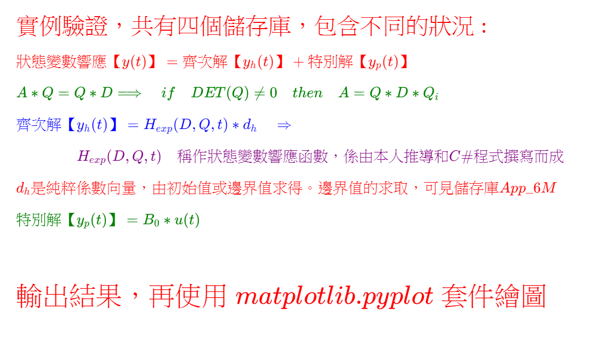
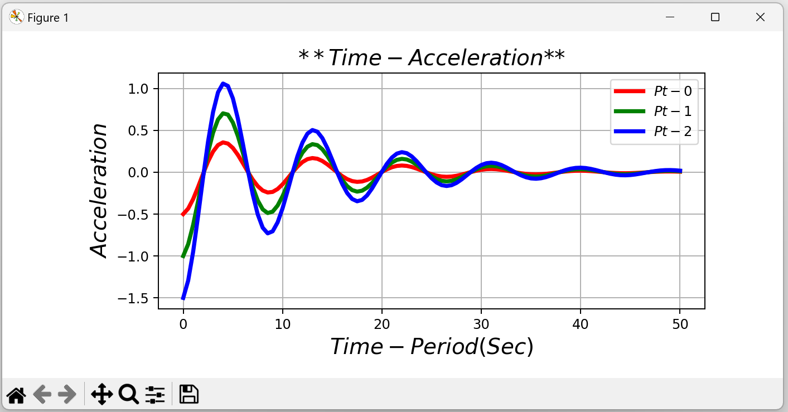
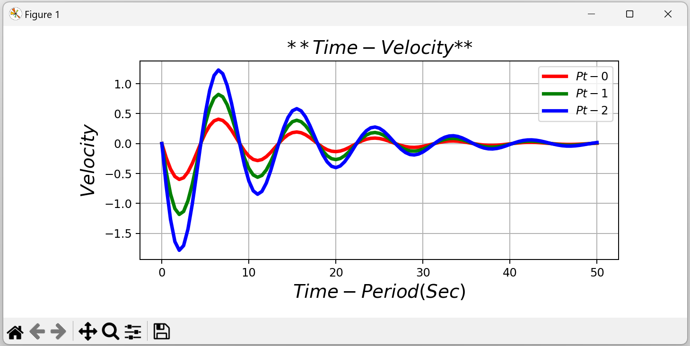

<!--    App_6R README.md      --> 

  
<!--  
## \[ \]
# \[ {\color{Fuchsia}\;精\;銳\;矩\;陣\;計\;算\;求\;解\;器\;}\]
### \[ {\color{Fuchsia} (Sharp \enspace Matrix \enspace Solver, \enspace SMS)}\]
-->  

  
  
<!--   
#  \[ \]
#### \[ { \color{Green} J. \quad L.\quad Humar} \]  
#### \[ { \color{Green} Dynamics \quad of\quad Structures \quad 第\quad502-504\quad頁 } \]
#  \[ \]
-->  

  
<!--    
### \( {\color{Red} 實例驗證，共有四個儲存庫，包含不同的狀況 : } \) 

##### \( { \color{Red} 狀態變數響應【y(t)】 = 齊次解【y_h(t)】 + 特別解【y_p(t)】} \) 

##### \( {\color{Green}A \ast Q = Q \ast D \Longrightarrow \quad if \quad DET(Q) \not= 0 \quad then \quad A = Q \ast D \ast Q_i} \) 

##### \( {\color{Blue}齊次解【y_h(t)】 =  H_{exp}(D, Q, t) * d_h \quad \Rightarrow } \) 

##### \( {\color{Purple}\qquad \qquad H_{exp}(D, Q, t)\quad 稱作狀態變數響應函數，係由本人推導和C \# 程式撰寫而成 } \)

##### \( {\color{red}d_h 是純粹係數向量，由初始值或邊界值求得。邊界值的求取，可見儲存庫App\_6M} \)  

##### \( {\color{Green}特別解【y_p(t)】 = B_0 * u(t) } \)  

## 

##  \( {\color{red}輸出結果，再使用 \; matplotlib.pyplot \; 套件繪圖} \) 
-->

1. App_6J 儲存庫的内容是，由已知初始值的條件，求解矩陣齊次微分方程式，狀態變數的響應值。  
2. App_6M 儲存庫的内容是，由已知邊界值的條件，求解矩陣齊次微分方程式，狀態變數的響應值，分別為t=4.5秒 y0={{-0.68877}, {-1.377293}}和t=16.5秒 y1={{0.11710}, {0.23071}}，求得的特徵值、特徵向量、和係數向量。與App_6J相同，故有相同的狀態變數響應值。
3. App_6P儲存庫的内容是，系統矩陣A相同，但已知yp(t)=Bo * u(t)，F(t)=Bf * u(t)，且令其週期是2秒，可求得F(t)和特別解。
4.  App_6R儲存庫的内容是，與App_6J完全相同，僅多設一個點，該點是第0點和第1點的合併點。  

## 

  
  
  

##   

##   
