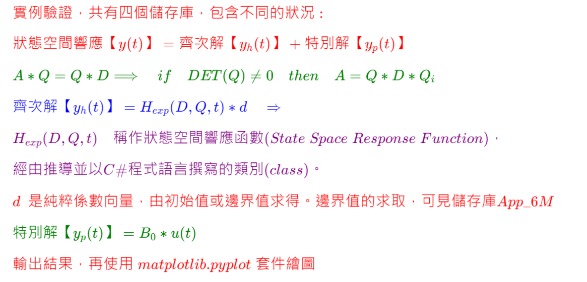

<!--    App_6R README.md      -->


<!--  
## \[ \]
# \[ {\color{Fuchsia}\;精\;銳\;矩\;陣\;計\;算\;求\;解\;器\;}\]
### \[ {\color{Fuchsia} (Sharp \enspace Matrix \enspace Solver, \enspace SMS)}\]
-->  

  
<!--   
#  \[ \]
#### \[ { \color{Green} J. \quad L.\quad Humar} \]  
#### \[ { \color{Green} Dynamics \quad of\quad Structures \quad 第\quad502-504\quad頁 } \]
#  \[ \]
-->  

---  

  
<!--    
#### \( {\color{Red} 實例驗證，共有四個儲存庫，包含不同的狀況 : } \)  

#### \( { \color{Red} 狀態空間響應【y(t)】 = 齊次解【y_h(t)】 + 特別解【y_p(t)】} \)  

#### \( {\color{Green}A \ast Q = Q \ast D \Longrightarrow \quad if \quad DET(Q) \not= 0 \quad then \quad A = Q \ast D \ast Q_i} \)  

#### \( {\color{Blue}齊次解【y_h(t)】 =  H_{exp}(D, Q, t) * d \quad \Rightarrow } \)  

#### \( {\color{Purple} H_{exp}(D, Q, t)\quad 稱作狀態空間響應函數 (State \; Space \; Response \; Function)，} \)  

#### \( \color{Purple} 經由推導並以 C\# 程式語言撰寫的類別 (class) 。 \)  

#### \( {\color{red}d \enspace 是純粹係數向量，由初始值或邊界值求得。邊界值的求取，可見儲存庫App\_6M} \)  

#### \( {\color{Green}特別解【y_p(t)】 = B_0 * u(t) } \)  

#### \( {\color{red}輸出結果，再使用 \; matplotlib.pyplot \; 套件繪圖} \)  
-->

---  

1. App_6J 儲存庫的内容是，由已知初始值的條件，求解矩陣齊次微分方程式的狀態空間響應值。  
2. App_6M 儲存庫的内容是，由已知邊界值的條件，求解矩陣齊次微分方程式的狀態空間響應值，分別為t=4.5秒 y0={{-0.68877}, {-1.377293}}和t=16.5秒 y1={{0.11710}, {0.23071}}，求得特徵(值)矩陣、模態(特徵向量)矩陣、和係數向量。與App_6J相同，故有相同的狀態空間響應值。
3. App_6P儲存庫的内容是，系統矩陣A相同，但已知yp(t)=Bo \* u(t)，F(t)=Bf \* u(t)，且令其週期是2秒，可求得F(t)和特別解。
4. App_6R儲存庫的内容是，與App_6J完全相同，僅多設一個點，該點是第0點和第1點的合併點。  
5. App_6R的狀態空間【數值】輸出，參見App6R.pdf或是App6R.cs，而狀態空間【視覺化響應圖】如下所示 :  

---  

## 

  
  
 

---

## CSharp 程式碼 : 

```c#
// J. L. Humar,"Dynamics of Structures"，第502-504頁
// 與 ConsoleApp_6J 相同，僅多出一個合並點，第2點是合併第0點和第1點。  

using System;
using Matrix_0; 

namespace ConsoleApp6R
{
    internal class Program
    {
        static void Main(string[] args)
        {

double[,] M = { { 2, 0 }, { 0, 1 } };
double[,] K = { { 3, -1 }, { -1, 1 } };
double[,] C = { { 0.4, -0.05 }, { -0.05, 0.2 } };
// t=0時，第0點和第1點，速度和位移之初始值。
double[,] y0Start = { { 0 }, { 0 }, { 1 }, { 2 } };

ReMatrix y0 = new ReMatrix(y0Start);
MKCMatrix MKC = new MKCMatrix(M, K, C);
ReMatrix A = new ReMatrix(MKC.Matrix);

EIG eig = new EIG(A);
CxMatrix D = eig.CxMatrixD;
CxMatrix V = eig.CxVector; 
CxMatrix Q = eig.CxMatrixQ;

CxToHexp Hexp = new CxToHexp(D, Q, 0);
CxMatrix MatTemp = Hexp.GetCxMatrix;
CxMatrix d = ~MatTemp * y0;

// 列印系統與狀態參數。
Console.Write("\n****{0,5}系{0,5}統{0,5}與{0,5}狀{0,5}態{0,5}參{0,5}數{0,5}****\n", "");
    
Console.Write("\n***{0,5}特徵值V{0,5}***\n\n{1}\n", "", new PR(V));
Console.Write("\n***{0,5}特徵向量矩陣Q{0,5}***\n\n{1}\n", "", new PR(Q));
Console.Write("\n***{0,5}係數向量d{0,5}***\n\n{1}\n", "", new PR(d));

double step = 0.5;
int iRow = (int)(50 / step + 1);
int iCol = M.GetLength(1) + 2;
ReMatrix Disp = new ReMatrix(iRow, iCol);
ReMatrix Vel = new ReMatrix(iRow, iCol);
ReMatrix Acc = new ReMatrix(iRow, iCol);

for (int i = 0; i != iRow; i++)
{
    double t = step * i;

    Hexp = new CxToHexp(D, Q, t);
    MatTemp = Hexp.GetCxMatrix;
    ReMatrix y = (ReMatrix)(MatTemp * d); 
    ReMatrix yDot = A * y;

    Acc.Matrix[i, 0] = t;
    Acc.Matrix[i, 1] = yDot.Matrix[0, 0];
    Acc.Matrix[i, 2] = yDot.Matrix[1, 0];
    Acc.Matrix[i, 3] = Acc.Matrix[i, 1] + Acc.Matrix[i, 2]; 

    Vel.Matrix[i, 0] = t;
    Vel.Matrix[i, 1] = y.Matrix[0, 0];
    Vel.Matrix[i, 2] = y.Matrix[1, 0];
    Vel.Matrix[i, 3] = Vel.Matrix[i, 1] + Vel.Matrix[i, 2]; 

    Disp.Matrix[i, 0] = t;
    Disp.Matrix[i, 1] = y.Matrix[2, 0];
    Disp.Matrix[i, 2] = y.Matrix[3, 0]; 
    Disp.Matrix[i, 3] = Disp.Matrix[i, 1] + Disp.Matrix[i, 2]; 
}

// 列印標題。   
Console.Write("\n****{0,10}狀{0,5}態{0,5}響{0,5}應{0,10}****\n", "");

// 列印空間節點之狀態響應(變位，速度，和加速)。 
Console.Write("\n{0,5}***位移反應量***{0,5}\n{0,8}時間(秒)" +
    "{0,8}第0點位移{0,8}第1點位移\n\n{1}", "", new PR(Disp));
Console.Write("\n{0,5}***速度反應量***{0,5}\n{0,8}時間(秒)" +
    "{0,8}第0點速度{0,8}第1點速度\n\n{1}", "", new PR(Vel));
Console.Write("\n***{0,5}加速度反應量{0,5}***\n{0,8}時間(秒)" +
    "{0,8}第0點加速度{0,7}第1點加速度\n\n{1}", "", new PR(Acc));

// 列印時間、節點變位、速度、和加速度等序列。 
Console.Write("\n時間序列\n{0}\n", new PR4(Disp, 0));

Console.Write("\n第0點變位序列\n{0}\n", new PR4(Disp, 1));
Console.Write("\n第1點變位序列\n{0}\n", new PR4(Disp, 2));
Console.Write("\n點合併變位序列\n{0}\n", new PR4(Disp, 3)); 

Console.Write("\n第0點速度序列\n{0}\n", new PR4(Vel, 1));
Console.Write("\n第1點速度序列\n{0}\n", new PR4(Vel, 2));  
Console.Write("\n點合併變位序列\n{0}\n", new PR4(Vel, 3)); 

Console.Write("\n第0點加速度序列\n{0}\n", new PR4(Acc, 1));
Console.Write("\n第1點加速度序列\n{0}\n", new PR4(Acc, 2));  
Console.Write("\n點合併變位序列\n{0}\n", new PR4(Acc, 3)); 

Console.Write("\n\n"); 

        }
    }
}
```

---  

###  
